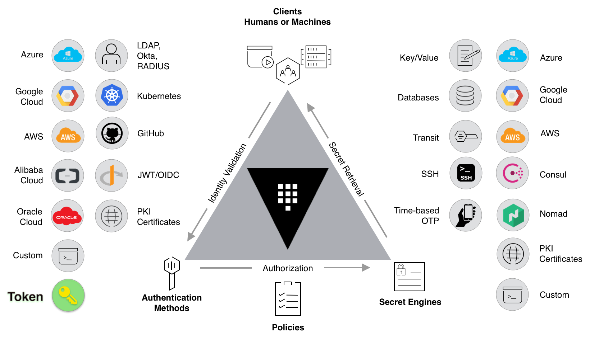

# SNY.OSS.VLT.01.01.00
Learning HashiCorp Vault

## Labs

[00 - Prerequisites](./labs/00-Prerequisites/README.md)

[01 - Fork and clone this repo](./labs/01-Fork_and_clone_this_repo/README.md)

[02 - Provision the environment](./labs/02-Provision_the_environment/README.md)

[03 - Initialize and unseal Vault](./labs/03-Initialize_and_unseal_vault/README.md)

[04 - Configure the Vault CLI](./labs/04-Configure_Vault_CLI/README.md)

[05 - Explore the Vault GUI](./labs/05-Explore_the_Vault_GUI/README.md)

[06 - Your first secret](./labs/06-Your_first_secret/README.md)

[07 - Token authentication](./labs/07-Token_authentication/README.md)

[08 - Policy-based authorization](./labs/08-Policy-based_authorization/README.md)

[09 - Dyanamic secrets](./labs/09-Dynamic_secrets/README.md)

[10 - Vault web UI](./labs/10-Vault_web_UI/README.md)

[11 - More about tokens](./labs/11-More_about_tokens/README.md)

[12 - OIDC authentication method](./labs/12-OIDC_authentication_method/README.md)

[13 - Inject secrets as container variable](./labs/13-Inject_secrets_as_container_variables/README.md)

[14 - Custom secret engine plugin](./labs/14-Custom_secret_engine_plugin/README.md)

[15 - Rotate database credentials](./labs/15-Rotate_database_credentials/README.md)

[16 - Vault on HashiCorp Cloud Platform](./labs/16-Vault_on_HashiCorp_Cloud_Platform/README.md)

[17 - Custom authentication methods](./labs/17-Custom_authentication_methods/README.md)

[18 - Encryption as a Service with Vault](./labs/18-Encryption_as_a_Service_with_Vault/README.md)

[19 - Vault as Certification Authority](./labs/19-Vault_as_Certification_Authority/README.md)

[20 - Vault monitoring with Prometheus stack](./labs/20-Vault_monitoring_with_Prometheus_stack/README.md)

## Appendices

[A - Sync copy of forked repo](./appendices/A-Sync_copy_of_forked_repo/README.md)