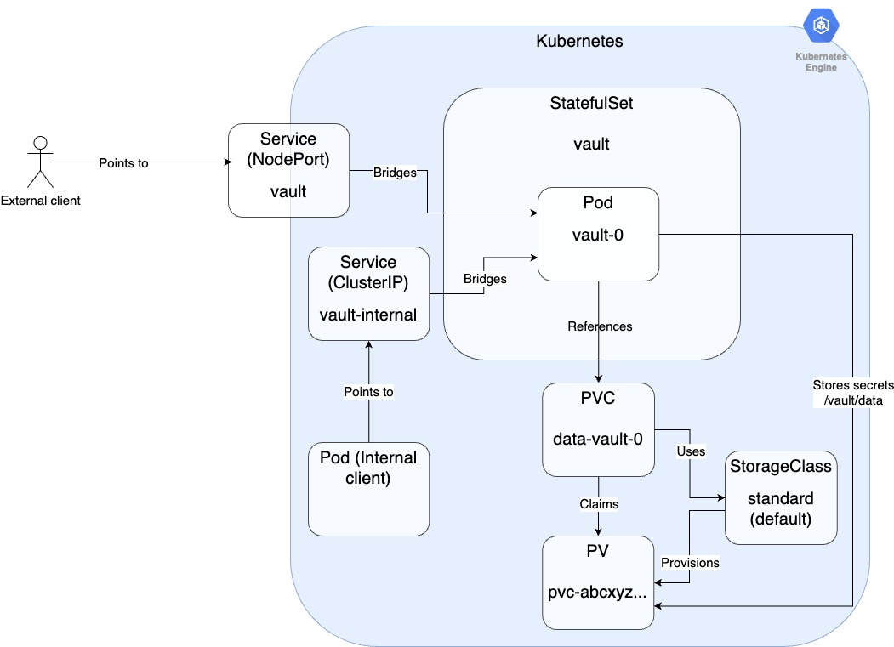

# Provision the environment

For this lab we will use a Kubernetes-based Vault environment that reflects the following diagram:



## Prerequisites 

Having completed labs:

- [00 - Prerequisites](./labs/00-Prerequisites/README.md)

- [01 - Fork and clone this repo](./labs/01-Fork_and_clone_this_repo/README.md)

- Having downloaded the minikube binary from https://minikube.sigs.k8s.io/docs/start/

- Having installed **kubectl** and **helm** on your PC

## Minikube

Start Minikube

```console
$ minikube start --kubernetes-version='v1.25.3'
😄   minikube v1.28.0 on Darwin 13.1 (arm64)
... 
🏄  Done! kubectl is now configured to use "minikube" cluster and "default" namespace by default
```

Check Minikube status

```console
$ minikube status
minikube
type: Control Plane
host: Running
kubelet: Running
apiserver: Running
kubeconfig: Configured
```

```console
$ kubectl get nodes
NAME       STATUS   ROLES           AGE   VERSION
minikube   Ready    control-plane   22s   v1.25.3
```

## Vault

Install Vault

```console
$ helm repo add hashicorp https://helm.releases.hashicorp.com
"hashicorp" has been added to your repositories
```

```console
$ helm repo update
Hang tight while we grab the latest from your chart repositories...
...Successfully got an update from the "hashicorp" chart repository
Update Complete. ⎈Happy Helming!⎈
```

```console
$ helm install vault hashicorp/vault --set "server.dev.enabled=false" --namespace vault --create-namespace --version v0.23.0 --values vault-values.yaml
NAME: vault
LAST DEPLOYED: Sat Mar 19 01:03:03 2022
NAMESPACE: vault
STATUS: deployed
REVISION: 1
NOTES:
Thank you for installing HashiCorp Vault!

Now that you have deployed Vault, you should look over the docs on using
Vault with Kubernetes available here:

https://www.vaultproject.io/docs/


Your release is named vault. To learn more about the release, try:

  $ helm status vault
  $ helm get manifest vault
```

Check the installation

```console
$ kubectl get pods -n vault
NAME                                   READY   STATUS    RESTARTS   AGE
vault-agent-injector-f96b59db4-m85wf   0/1     Running   0          31s
vault-0                                1/1     Running   0          31s
```