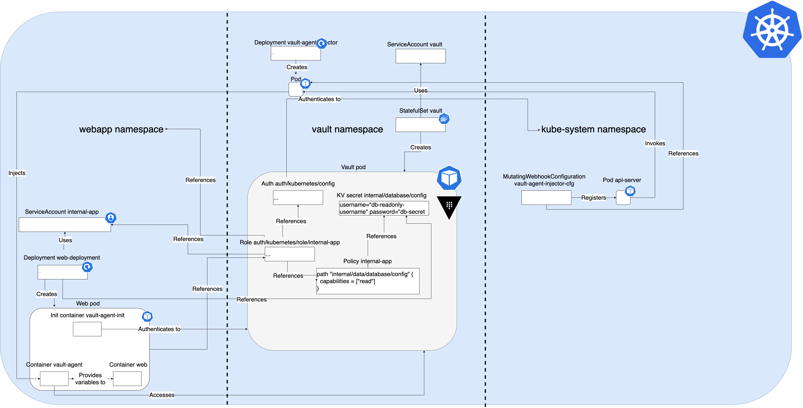

# Secrets injection as container variables

This lab resambles the picture below




Enter in the Vault pod

```console
$ kubectl exec -it vault-0 -n vault -- /bin/sh
/ $
```

Enable the KV secret engine

```console
$ vault secrets enable -path=internal kv-v2
Success! Enabled the kv-v2 secrets engine at: internal/
```

Create the secret

```console
$ vault kv put internal/database/config username="db-readonly-username" password="db-secret-password"
Key              Value
---              -----
created_time     2020-03-25T19:03:57.127711644Z
deletion_time    n/a
destroyed        false
version          1
```

Verify that the secret is defined at the path internal/database/config.

```console
$ vault kv get internal/database/config
====== Metadata ======
Key              Value
---              -----
created_time     2020-03-25T19:03:57.127711644Z
deletion_time    n/a
destroyed        false
version          1

====== Data ======
Key         Value
---         -----
password    db-secret-password
username    db-readonly-username
```

Enable the Kubernetes authentication method.

```console
$ vault auth enable kubernetes
Success! Enabled kubernetes auth method at: kubernetes/
```

Configure the Kubernetes authentication method to use the location of the Kubernetes API, the service account token, its certificate, and the name of Kubernetes' service account issuer (required with Kubernetes 1.21+).

```console
$ vault write auth/kubernetes/config \
    kubernetes_host="https://$KUBERNETES_PORT_443_TCP_ADDR:443" \
    token_reviewer_jwt="$(cat /var/run/secrets/kubernetes.io/serviceaccount/token)" \
    kubernetes_ca_cert=@/var/run/secrets/kubernetes.io/serviceaccount/ca.crt \
    issuer="https://kubernetes.default.svc.cluster.local"
Success! Data written to: auth/kubernetes/config
```

For a client to read the secret data defined at internal/database/config, requires that the read capability be granted for the path internal/data/database/config. This is an example of a policy. A policy defines a set of capabilities.

Write out the policy named internal-app that enables the read capability for secrets at path internal/data/database/config.

```console
$ vault policy write internal-app - <<EOF
path "internal/data/database/config" {
  capabilities = ["read"]
}
EOF
Success! Uploaded policy: internal-app
```

Create a Kubernetes authentication role named internal-app.

```console
$ vault write auth/kubernetes/role/internal-app \
    bound_service_account_names=internal-app \
    bound_service_account_namespaces=web \
    policies=internal-app \
    ttl=24h
Success! Data written to: auth/kubernetes/role/internal-app
```

Lastly, exit the vault-0 pod.

```console
$ exit
```

Create the application namespace 

```console
$ kubectl create ns web
namespace/web created
```

Create the application's service account

```console
$ kubectl create sa internal-app -n web
serviceaccount/internal-app created
```

Launch the application

```console
$ kubectl apply -f web-deployment.yaml -n web
```

Inspect the application

```console
$ kubectl get pods -l app=web -n web
NAME                             READY   STATUS    RESTARTS   AGE
web-deployment-6f6998b86-8d5lp   2/2     Running   0          2m
```

```console
$ kubectl describe pods -l app=web -n web
...
```

Check if the container sees the variables

```console
$ kubectl logs -l app=web -c web -n web 
username=db-readonly-username password=db-secret-password
```

The same applies also with CronJobs' pods, let's try:

```console
$ kubectl apply -f secret_job.yaml -n web
```

You should be able to read the secret envs from the CronJob's pod as well

```console
$ kubectl logs -l app=job -c job -n web 
username=db-readonly-username password=db-secret-password
```