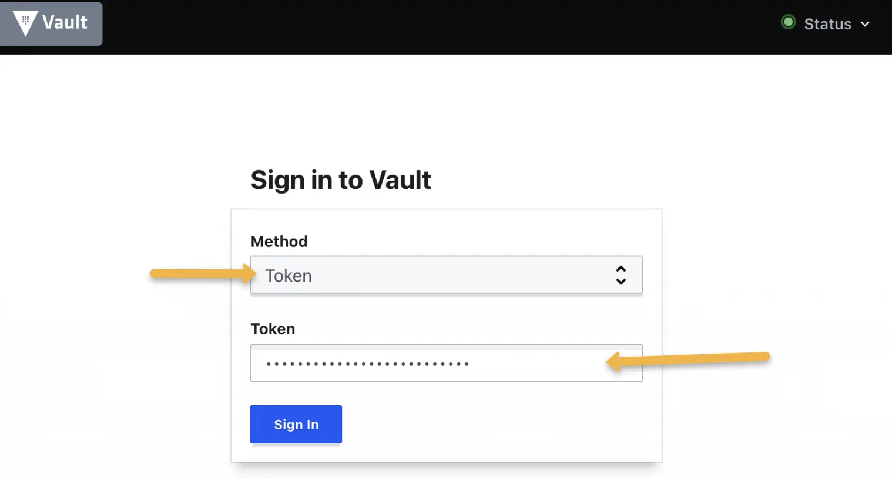
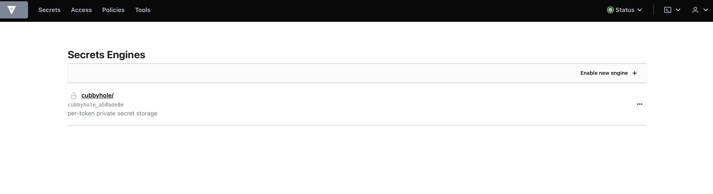

# Explore the Vault GUI

## Prerequisites 

Having completed labs:

- [00 - Prerequisites](./labs/00-Prerequisites/README.md)

- [01 - Fork and clone this repo](./labs/01-Fork_and_clone_this_repo/README.md)

- [02 - Provision the environment](./labs/02-Provision_the_environment/README.md)

- [03 - Initialize and unseal Vault](./labs/03-Initialize_and_unseal_vault/README.md)


## Access the GUI


Run a port-forward (in another terminal)

```console
$ kubectl port-forward -n vault vault-0 8200:8200
```

The point your browser to http://localhost:8200

You should see the Vault login page:



As the authentication **Method** choose **Token** and in the **Token** field insert your root token (see lab before).

The Vault home page should appear:

