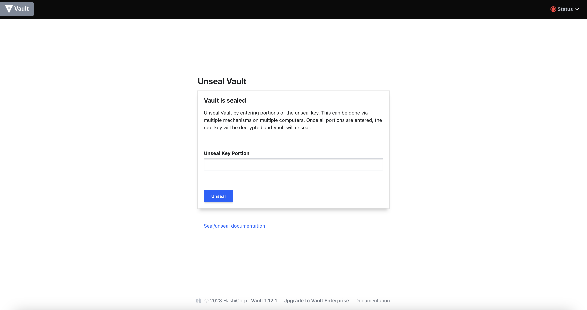
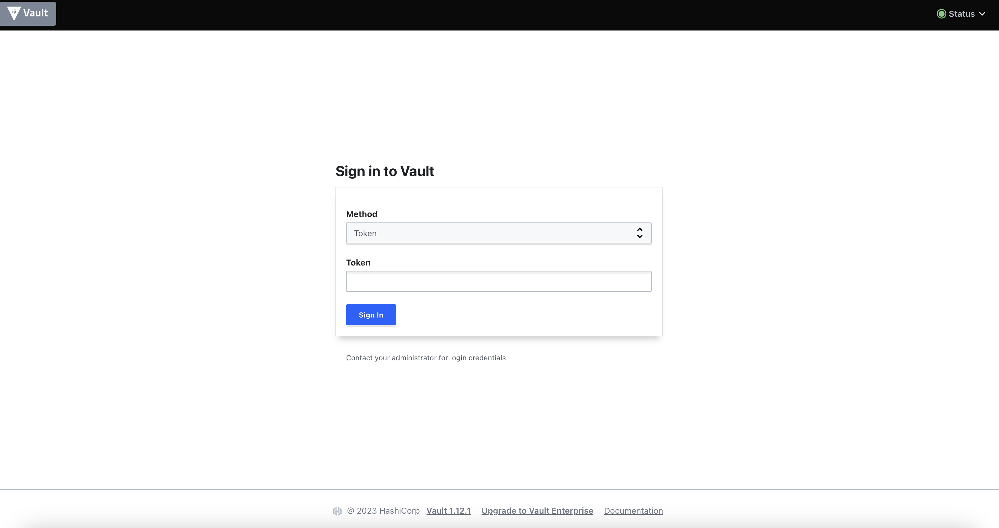
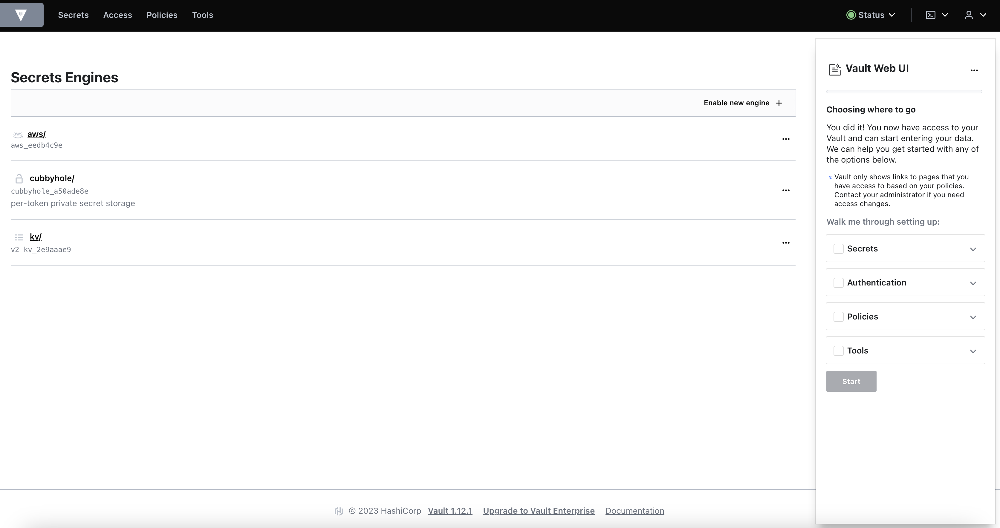
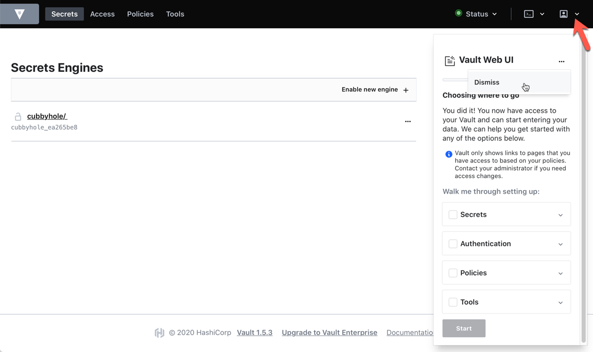
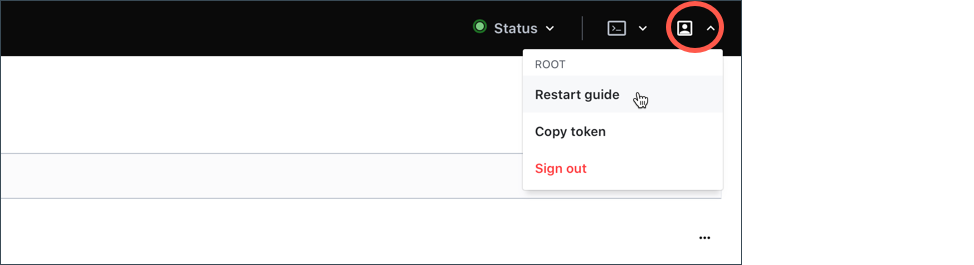

# Vault web UI

Vault features a web-based user interface (UI) that enables you to unseal, authenticate, manage policies and secrets engines.

When you operate Vault in development mode the UI is automatically enabled, but when Vault is running outside of development mode, the UI is not activated by default.

For this lab, the Vault web UI has been already configured and activated, you just need to start Vault.

## Prerequisites 

Having completed labs:

- [00 - Prerequisites](./labs/00-Prerequisites/README.md)

- [01 - Fork and clone this repo](./labs/01-Fork_and_clone_this_repo/README.md)

- [02 - Provision the environment](./labs/02-Provision_the_environment/README.md)

- [03 - Initialize and unseal Vault](./labs/03-Initialize_and_unseal_vault/README.md)

- [04 - Configure the Vault CLI](./labs/04-Configure_Vault_CLI/README.md)


## Access the UI

Open the Kubernetes port forward to access the UI:

```console
$ kubectl port-forward -n vault vault-0 8200:8200
```

Now launch a web browser, and enter http://localhost:8200/ui in the address. (remember to substitue the)

The following screen appears if the Vault instance is not unsealed yet.



To unseal Vault, paste in that field the content of your environment variable VAULT_UNSEAL_KEY, for example:

```console
$ echo $VAULT_UNSEAL_KEY                                                  
dkhjadhfsafljsdlfòodkòdfskòdfskldfskl=
```

If your terminal has the VAULT_UNSEAL_KEY unset, please refer to [lab 03](../03-Initialize_and_unseal_vault/README.md) to have it set.

Once unsealed from the UI, the Vault login screen appears:



Notice in the top right corner that the Vault status is green (Unsealed) now.

To login in the UI, you can use all the authentication methods supported by Vault, in this case just type the root token (to find the root token, check the content of the VAULT_ROOT_TOKEN variable on your terminal, if not set, check the [lab 04](../04-Configure_Vault_CLI/README.md))

Once logged in, the following home page appears 



The content of your home page depends on the secret engines you enabled so far (in my case **kv** and **aws**).

Vault UI has a built-in tutorial to navigate you through the common steps to operate various Vault features.



For now, click Dismiss to close it out. You can restart the guide later.


