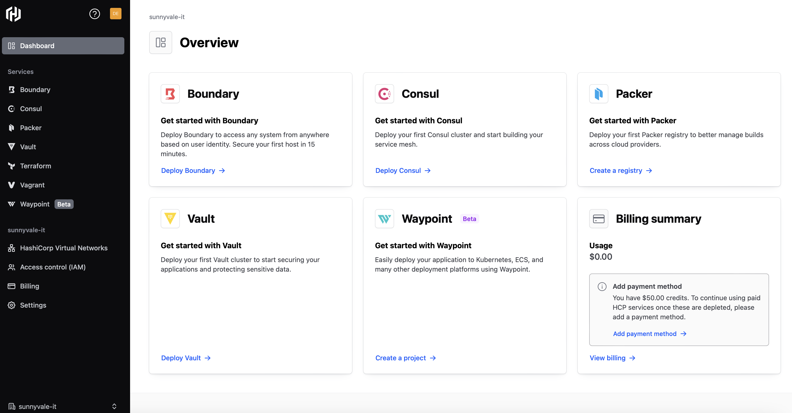
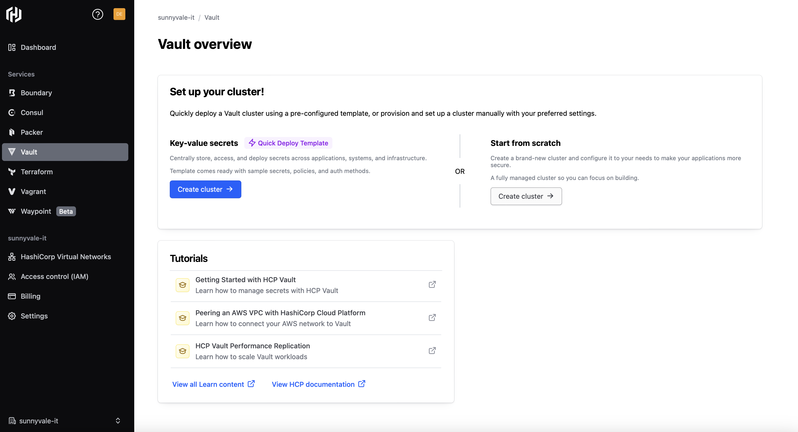
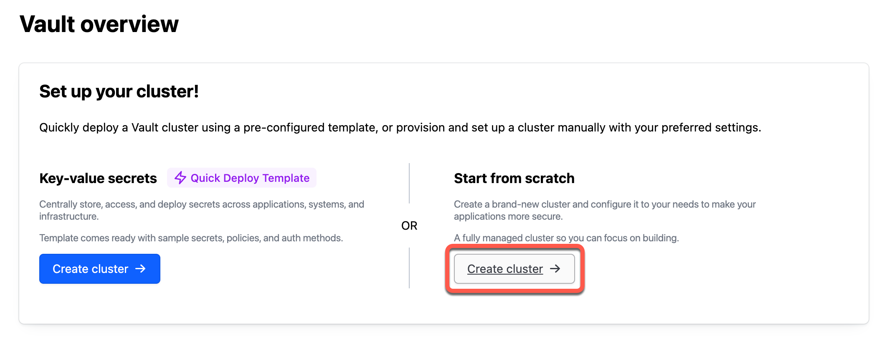
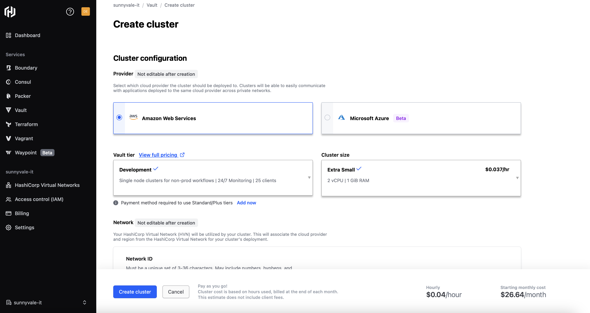
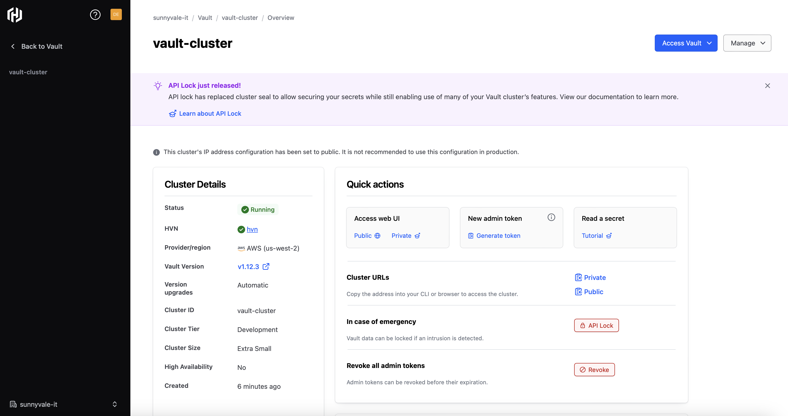

# Vault on HashiCorp Cloud Platform

## Prerequisites

- A vault CLI installed on you laptop
- An HCP Portal account

## Access the portal

Launch the [HCP Portal](https://cloud.hashicorp.com) and login. If you don't have an account, you can create one for free (just skip the billing account creation) and obtain 50 € in credits.

Once logged in, you should see a screen similar to:



This is where you can use all the HashiCorp softwares (Terraform, Consul, Vault, Waypoint, Packer and Boundary) on Cloud.

## Deploy Vault

Before using Vault, you need to create an instance. Just cliekc on **Deploy Vault**.

Once clicked, the Vault deployment page opens.



Click on the **Create cluster** button under **Start from scratch**.



Select your preferred cloud provider. At the time of writing, only AWS and Azure are supported:



Note under the **Vault tier** pull down menu the selected option **Development** and under **Cluster size** **Extra Small**

Under the Network section, accept or edit the name, region, and CIDR block for the HashiCorp Virtual Network (HVN).

For this lab, the cluster must be accessible on the public internet.

Under the Basics section, accept or edit the default Cluster ID.

Once ready, click on the **Create cluster** button.

After 10 mins, the Vault cluster is ready:



## Use Vault

On the Vault cluster page, click on **Access Vault** then **Command-line**. Copy both `VAULT_ADDR` (the public one) then set the variables on your terminal

```console
$ export VAULT_ADDR="https://vault-cluster-xyz.123.hashicorp.cloud:8200"; export VAULT_NAMESPACE="admin"
```

To create an admin Vault token, close this popup windows and get back on the cluster page. Here you can generate a **New admin token**. 

Once done, copy it and use it to set the `VAULT TOKEN` variable:

```console
$ export VAULT_TOKEN=dzoejeoidoiewjdoiew
```

To login into you cluster type:

```console
$ vault login $VAULT_TOKEN
Success! You are now authenticated. The token information displayed below
is already stored in the token helper. You do NOT need to run "vault login"
again. Future Vault requests will automatically use this token.

Key                  Value
---                  -----
token                dzoejeoidoiewjdoiew
token_accessor       5wCZacI.3iyv6
token_duration       5h57m57s
token_renewable      false
token_policies       ["default" "hcp-root"]
identity_policies    []
policies             ["default" "hcp-root"]
```

This token lasts for 6 hours, it is not renewable and has two policies associated: **default** and **hcp-root**