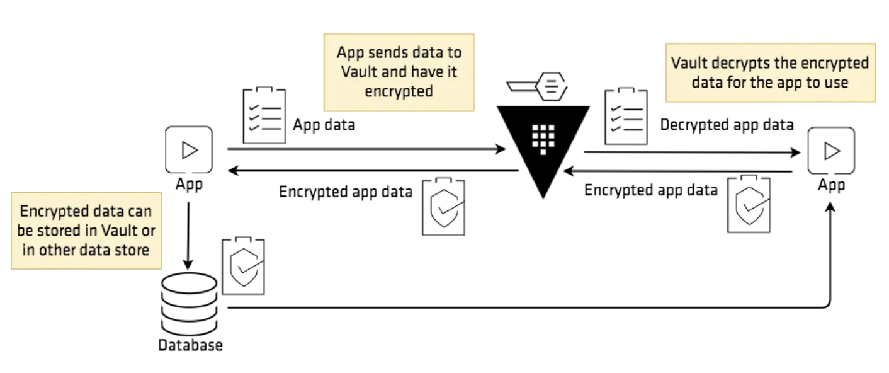

# Encryption as a Service with Vault

Vault can be used as a platform to encrypt/descrypt data on behalf of application clients.

The transit secrets engine enables security teams to fortify data during transit and at rest. So even if an intrusion occurs, your data is encrypted with AES-GCM with a 256-bit AES key or other supported key types. Even if an attacker were able to access the raw data, they would only have encrypted bits. This means attackers would need to compromise multiple systems before exfiltrating data.

In this lab we will demonstrate the use case deplicted in this image:



## Prerequisites 

Having completed labs:

- [00 - Prerequisites](./labs/00-Prerequisites/README.md)

- [01 - Fork and clone this repo](./labs/01-Fork_and_clone_this_repo/README.md)

- [02 - Provision the environment](./labs/02-Provision_the_environment/README.md)

- [03 - Initialize and unseal Vault](./labs/03-Initialize_and_unseal_vault/README.md)

- [04 - Configure the Vault CLI](./labs/04-Configure_Vault_CLI/README.md)


## Personas

The end-to-end scenario described in this tutorial involves two personas:

admin with privileged permissions to manage the encryption keys
apps with un-privileged permissions encrypt/decrypt secrets via APIs

## Configure Transit secrets engine (Persona: admin)

The transit secrets engine must be configured before it can perform its operations. This step is usually done by an **admin** or configuration management tool.

```console
$ vault secrets enable transit
```