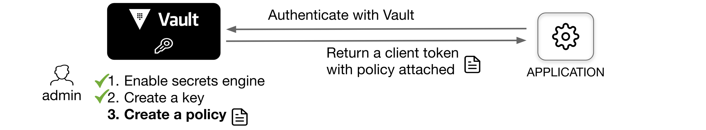

# Encryption as a Service with Vault

Vault can be used as a platform to encrypt/descrypt data on behalf of application clients.

The transit secrets engine enables security teams to fortify data during transit and at rest. So even if an intrusion occurs, your data is encrypted with AES-GCM with a 256-bit AES key or other supported key types. Even if an attacker were able to access the raw data, they would only have encrypted bits. This means attackers would need to compromise multiple systems before exfiltrating data.

In this lab we will demonstrate the use case deplicted in this image:


## Prerequisites 

Having completed labs:

- [00 - Prerequisites](./labs/00-Prerequisites/README.md)

- [01 - Fork and clone this repo](./labs/01-Fork_and_clone_this_repo/README.md)

- [02 - Provision the environment](./labs/02-Provision_the_environment/README.md)

- [03 - Initialize and unseal Vault](./labs/03-Initialize_and_unseal_vault/README.md)

- [04 - Configure the Vault CLI](./labs/04-Configure_Vault_CLI/README.md)


## Personas

The end-to-end scenario described in this tutorial involves two personas:

admin with privileged permissions to manage the encryption keys
apps with un-privileged permissions encrypt/decrypt secrets via APIs

## Configure Transit secrets engine (Persona: admin)

The transit secrets engine must be configured before it can perform its operations. This step is usually done by an **admin** or configuration management tool.

```console
$ vault secrets enable transit
Success! Enabled the transit secrets engine at: transit/
```

Create an encryption key ring named orders by executing the following command.

```console
$ vault write -f transit/keys/orders
Success! Data written to: transit/keys/orders
```

## Create a token for Vault clients (Persona: admin)

Vault clients must authenticate with Vault and acquire a valid token with appropriate policies allowing to request data encryption and decryption using the specific key.



When the transit secrets engine is enabled at transit, the policy must include the following.

```console
$ vault policy write app-orders -<<EOF
path "transit/encrypt/orders" {
   capabilities = [ "update" ]
}
path "transit/decrypt/orders" {
   capabilities = [ "update" ]
}
EOF
Success! Uploaded policy: app-orders
```

Create a token with app-orders policy attached.

```console
$ vault token create -policy=app-orders
Key                  Value
---                  -----
token                dededodkoiwdowedoewdoeiwjdoiwedoeiwnd
token_accessor       m7cytkxYsGmzpLEyvq7YcE16
token_duration       768h
token_renewable      true
token_policies       ["app-orders" "default"]
identity_policies    []
policies             ["app-orders" "default"]
```

Create a `APP_ORDER_TOKEN` environment variable to store the generated client token value.

export APP_ORDER_TOKEN="dededodkoiwdowedoewdoeiwjdoiwedoeiwnd"

## Encrypt secrets (Persona: apps)

Once the transit secrets engine has been configured, any Vault client holding a valid token with the proper permissions can send data to encrypt.

```console
$ VAULT_TOKEN=$APP_ORDER_TOKEN vault write transit/encrypt/orders \
    plaintext=$(base64 <<< "4111 1111 1111 1111")
Key            Value
---            -----
ciphertext     vault:v1:u+wL5ccabqpJZhV11ZI364q9yvWLCs25yPnPQTdNdur38t+AqKqvlT/XICSD2uHI
key_version    1
```

Notice that the ciphertext starts with vault:v1:. This prefix indicates that this value is wrapped by vault and the version of the orders encryption key used was v1. Therefore, when you decrypt this ciphertext, Vault knows to use v1 of the key. Later, you are going to rotate the encryption key and learn how to re-wrap the ciphertext with the latest version of the encryption key.

## Decrypt ciphertext (Persona: apps)

Any client holding a valid token with proper permissions can decrypt ciphertext generated by Vault. To decrypt the ciphertext, invoke the transit/decrypt endpoint.

Execute the following command to decrypt the ciphertext emitted in the encrypt secrets step. Be sure to set the \<ciphertext\> value to the value returned in the previous step.

```console
$ VAULT_TOKEN=$APP_ORDER_TOKEN vault write transit/decrypt/orders ciphertext=vault:v1:u+wL5ccabqpJZhV11ZI364q9yvWLCs25yPnPQTdNdur38t+AqKqvlT/XICSD2uHI
Key          Value
---          -----
plaintext    NDExMSAxMTExIDExMTEgMTExMQo=
```

```console
$ base64 --decode <<< "NDExMSAxMTExIDExMTEgMTExMQo="
4111 1111 1111 1111
```

## Rotate the encryption key (Persona: admin)

One of the benefits of using the Vault transit secrets engine is its ability to easily rotate encryption keys. Keys can be rotated manually by a human or by an automated process which invokes the key rotation API endpoint through cron, a CI pipeline, a periodic Nomad batch job, Kubernetes Job, etc.

Vault maintains the versioned keyring and the admin can decide the minimum version allowed for decryption operations. When data is encrypted using Vault, the resulting ciphertext is prepended by the version of the key used to encrypt it.

```consoe
$ vault write -f transit/keys/orders/rotate
Success! Data written to: transit/keys/orders/rotate
```

Encrypt another data

```console
$ vault write transit/encrypt/orders plaintext=$(base64 <<< "4111 1111 1111 1111")
Key            Value
---            -----
ciphertext     vault:v2:4ejX3wUEqXJXImrT2skRz2XlmQTP+b311+AJPbmuwX201qGuUECsqn0sUK2M0gDt
key_version    2
```

Notice that after rotating the encryption key, the ciphertext starts with "vault:v2".  This indicates that the data is encrypted using the latest version of the key after the rotation.

Rewrap your ciphertext from the first encrypt secrets step with the latest version of the encryption key.

```console
$ vault write transit/rewrap/orders \
    ciphertext="vault:v1:u+wL5ccabqpJZhV11ZI364q9yvWLCs25yPnPQTdNdur38t+AqKqvlT/XICSD2uHI"
Key            Value
---            -----
ciphertext     vault:v2:+zHJ8qWD/5qCJl4lKpF+Ood8PormDROlh9F1sa9TWOmlgXNEODtzLqFxmasHy5B3
key_version    2
```

Notice that the resulting ciphertext now starts with "vault:v2:".

This operation does not reveal the plaintext data. But Vault will decrypt the value using the appropriate key in the keyring and then encrypt the resulting plaintext with the newest key in the keyring.

## Automatic key rotation

Instead of rotating the key manually, you can configure Vault to automatically rotate the encryption key at a user-defined time interval.


```console
$ vault read transit/keys/orders
Key                       Value
---                       -----
allow_plaintext_backup    false
auto_rotate_period        0s
deletion_allowed          false
derived                   false
exportable                false
imported_key              false
keys                      map[1:1677016014 2:1677016703]
latest_version            2
min_available_version     0
min_decryption_version    1
min_encryption_version    0
name                      orders
supports_decryption       true
supports_derivation       true
supports_encryption       true
supports_signing          false
type                      aes256-gcm96
```

The auto_rotate_period parameter configures the amount of time the key should live before being automatically rotated. A value of 0 (default) disables automatic rotation for the key.

Configure to automatically rotate the orders key every 24 hours.

```console
$ vault write transit/keys/orders/config auto_rotate_period=24h
```

Read the orders key information again.

```console
$ vault read transit/keys/orders
Key                       Value
---                       -----
allow_plaintext_backup    false
auto_rotate_period        24h
deletion_allowed          false
derived                   false
exportable                false
imported_key              false
keys                      map[1:1677016014 2:1677016703]
latest_version            2
min_available_version     0
min_decryption_version    1
min_encryption_version    0
name                      orders
supports_decryption       true
supports_derivation       true
supports_encryption       true
supports_signing          false
type                      aes256-gcm96
```

Vault will automatically rotate the orders key every 24 hours.

When you encrypt your data, the encryption key used to encrypt the plaintext is referred to as a data key. This data key needs to be protected so that your encrypted data cannot be decrypted easily by an unauthorized party. In encrypt secrets step, you encrypted your data by specifying the key ring name (orders) and the actual data key used to encrypt the data was never presented to you.