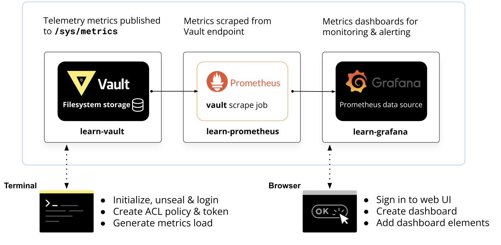

# Vault monitoring with Prometheus stack

## Prerequisites 

Having completed labs:

- [00 - Prerequisites](./labs/00-Prerequisites/README.md)

- [01 - Fork and clone this repo](./labs/01-Fork_and_clone_this_repo/README.md)

- [02 - Provision the environment](./labs/02-Provision_the_environment/README.md)

- [03 - Initialize and unseal Vault](./labs/03-Initialize_and_unseal_vault/README.md)

- [04 - Configure the Vault CLI](./labs/04-Configure_Vault_CLI/README.md)

- Helm installed locally

## Install the Prometheus stack on Kubernetes

helm repo add prometheus-community https://prometheus-community.github.io/helm-charts

helm repo update

helm install prometheus prometheus-community/kube-prometheus-stack -n prometheus-stack --create-namespace

kubectl port-forward -n prometheus-stack svc/prometheus-grafana 3000:80 --address '0.0.0.0'

helm upgrade vault hashicorp/vault --set "server.dev.enabled=false" --namespace vault --version v0.23.0 --values ../02-Provision_the_environment/vault-values.yaml

kubectl get secret --namespace prometheus-stack prometheus-grafana -o jsonpath="{.data.admin-password}" | base64 --decode ; echo

kubectl port-forward -n prometheus-stack svc/prometheus-kube-prometheus-prometheus 9090:9090 --address '0.0.0.0'